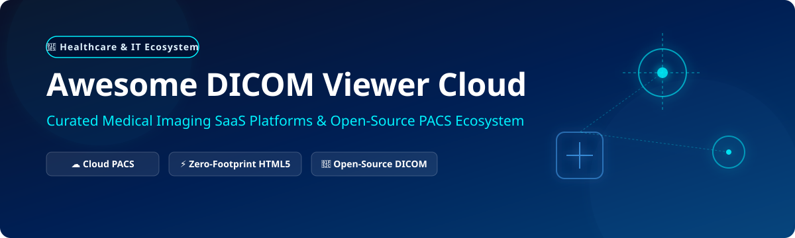

<p align="center">
  
</p>

# 🏥 Awesome DICOM Viewer Cloud Ecosystem ☁️

[](https://awesome.re)
[](https://opensource.org/licenses/MIT)
[](https://github.com/ishandutta2007/Awesome-Dicom-Viewer-Cloud/pulls)
[](https://www.dicomstandard.org/)

> 🩺 **Curated Directory of SaaS Products, Web-Based Medical Imaging Solutions & Open-Source Cloud DICOM Projects**  
> *Focused on Zero-Footprint HTML5 Viewers, Cloud PACS Integration, DICOMweb Standard Protocols, and Teleradiology Infrastructure.*

---

## 📌 Table of Contents 📑
- [🚀 Overview](#-overview)
- [🏢 SaaS & Hosted Cloud DICOM Platforms](#-saas--hosted-cloud-dicom-platforms)
- [🔬 Open-Source GitHub Projects](#-open-source-github-projects)
- [🛠️ Architecture & Integration Blueprints](#-architecture--integration-blueprints)
- [🤝 How to Contribute](#-how-to-contribute)
- [⚠️ Disclaimer & Compliance](#%EF%B8%8F-disclaimer--compliance)

---

## 🚀 Overview

Modern healthcare radiology requires instant, secure, and cross-platform access to medical imaging studies (CT, MRI, PET, Ultrasound, X-ray). **Cloud DICOM Viewers** eliminate the requirement for heavy local workstation installations by enabling zero-footprint web viewing directly inside modern web browsers via standard HTTP/DICOMweb APIs (STOW-RS, WADO-RS, QIDO-RS).

This repository categorizes the top commercial **SaaS platforms** and **open-source developer tools** powering web medical imaging globally.

---

## 🏢 SaaS & Hosted Cloud DICOM Platforms

> 📊 **Market Intelligence & Sector Structure**: The global **Cloud PACS & Medical Imaging SaaS Market** is estimated at **$4.5 Billion in 2026** and projected to reach **$7.8 Billion by 2030** (CAGR 11.2%). The sector is **moderately fragmented**: enterprise market share is anchored by consolidated healthcare IT giants (Philips, Visage Imaging, GE HealthCare/Ambra Health), while specialized agile cloud PACS SaaS providers (PostDICOM, Medicai, MedDream) actively serve ambulatory clinics, diagnostic centers, and teleradiology groups.

| 🏢 Product & Platform | 📝 Key Features & Overview | 💼 Company Scale / Financials | 💳 Starting Tier Price | 🎁 Free Tier / Trial Details |
| :--- | :--- | :--- | :--- | :--- |
| **[Philips IntelliSpace Enterprise](https://www.philips.com/healthcare)** | 🌐 Enterprise clinical informatics suite with multi-region cloud PACS, zero-footprint web viewer, and advanced clinical diagnostic modules. | 🏢 **~$18.5B Annual Revenue**<br>*(Koninklijke Philips N.V.)* | 💳 **$1,200 / month**<br>*(Enterprise starting tier)* | 🎁 **30-Day Sandbox Trial**<br>*(Enterprise sandbox up to 50 test studies)* |
| **[Visage Imaging (Visage 7)](https://visageimaging.com/)** | ⚡ High-speed server-side rendering enterprise diagnostic viewer for massive 3D volume imaging, CT/MRI fusion, and radiology workflows. | 📈 **~$11.2B Market Cap**<br>*(AUD $16.8B / ~$175M Annual Rev)* | 💳 **$3.50 / study**<br>*(Min. $50,000/yr enterprise contract)* | 🎁 **14-Day Guided Sandbox**<br>*(Institutional evaluation with 10 test datasets)* |
| **[Ambra Health](https://ambrahealth.com/)** | ☁️ Scalable cloud PACS and medical image management platform with web DICOM viewer, routing, and patient portal integrations. | 🤝 **~$2.3B Valuation**<br>*(Acquired by GE HealthCare)* | 💳 **$500 / month**<br>*(Starter practice package)* | 🎁 **14-Day Full Feature Trial**<br>*(Includes up to 25 GB cloud storage)* |
| **[PostDICOM](https://www.postdicom.com/)** | 🩺 CE-certified diagnostic HTML5 zero-footprint DICOM viewer with 3D reconstruction, MPR, MIP, DICOM sharing, and automated device sync. | 💼 **~$15M Valuation**<br>*(~$3.5M Est. Annual Revenue)* | 💳 **$80 / month**<br>*(Solo Practitioner billed annually)* | 🎁 **7-Day Free Trial**<br>*(Full CE-marked viewer access + 50 GB storage)* |
| **[Medicai](https://medicai.io/)** | 🏥 Collaborative cloud PACS platform built for diagnostic clinics and telemedicine networks with web DICOM viewing & custom links. | 💼 **~$10M Valuation**<br>*(~$2M Est. Annual Revenue)* | 💳 **$209 / month**<br>*(Starter Plan billed annually)* | 🎁 **14-Day Free Trial**<br>*(Includes up to 50 GB storage & 100 DICOM studies)* |
| **[MedDream](https://www.meddream.com/)** | 🔬 FDA 510(k) cleared & CE certified zero-footprint HTML5 DICOM viewer supporting multi-modality MPR, 3D volume, and PACS connectivity. | 💼 **~$8M Valuation**<br>*(Softneta ~$2.5M Annual Revenue)* | 💳 **$29 / month**<br>*(Per concurrent user seat license)* | 🎁 **30-Day Free Trial**<br>*(Supports up to 50 test study uploads)* |
| **[Horos Cloud (Purview)](https://horosproject.org/)** | 🍏 Cloud extension and backup services for macOS Horos ecosystem, enabling browser viewing, sharing, and offsite DICOM archiving. | 💼 **~$6M Valuation**<br>*(Purview ~$1.8M Annual Revenue)* | 💳 **$150 / month**<br>*(Purview Image Cloud starter tier)* | 🎁 **14-Day Free Trial**<br>*(Includes 5 GB storage & 20 DICOM studies)* |
| **[OsiriX Cloud](https://www.osirix-viewer.com/)** | 🖥️ Cloud viewing and synchronization suite linked with OsiriX MD macOS DICOM workstation for remote clinical image access. | 💼 **~$5M Valuation**<br>*(Pixmeo ~$1.5M Annual Revenue)* | 💳 **$69 / month**<br>*(or $699/year OsiriX MD subscription)* | 🎁 **Demo Version Trial**<br>*(Watermarked viewing limited to 100 images/series)* |
| **[RadiAnt Cloud](https://www.radiantviewer.com/)** | ⚡ Fast, intuitive medical image viewing cloud extension powered by Medixant RadiAnt DICOM workstation technology. | 💼 **~$3M Valuation**<br>*(Medixant ~$800K Annual Revenue)* | 💳 **$29 / year**<br>*(Per workstation seat license)* | 🎁 **14-Day Free Trial**<br>*(Full diagnostic features up to 20 studies)* |
| **[MicroDicom Cloud](https://www.microdicom.com/)** | 💻 Lightweight web DICOM viewing platform enabling fast study preview, measurement, and DICOM format conversion. | 💼 **~$2M Valuation**<br>*(~$600K Est. Annual Revenue)* | 💳 **$29 / year**<br>*(Single-user cloud workspace license)* | 🎁 **14-Day Free Trial**<br>*(Evaluation version supporting 30 series previews)* |

---

## 🔬 Open-Source GitHub Projects

The open-source medical imaging ecosystem forms the core foundation for global clinical research, self-hosted hospital PACS, and custom AI diagnostic pipelines. 

> *The table below is sorted by **GitHub Star Count** (descending). Each star badge links directly to the repository's stargazers page.*

| ⭐ Repository & Project | 📊 Star Badge (Social) | 🛠️ Tech Stack & Language | 📝 Summary & Key Capabilities |
| :--- | :--- | :--- | :--- |
| **[OHIF Viewer](https://github.com/OHIF/Viewers)** | [](https://github.com/OHIF/Viewers/stargazers) | React, JavaScript, Cornerstone.js | 👑 **The de facto open-source zero-footprint Web DICOM viewer**. Extensible architecture, DICOMweb integration, lesion tracking, segmentations, and clinical workflow plugins. |
| **[pydicom](https://github.com/pydicom/pydicom)** | [](https://github.com/pydicom/pydicom/stargazers) | Python | 🐍 Pure Python package for reading, inspecting, modifying, and writing DICOM files. Essential component in medical AI/ML and research workflows. |
| **[Cornerstone.js](https://github.com/cornerstonejs/cornerstone)** | [](https://github.com/cornerstonejs/cornerstone/stargazers) | JavaScript, HTML5 Canvas | 🎨 Core JavaScript library for rendering medical images in web browsers. Powers OHIF and many commercial/open-source DICOM web portals. |
| **[DWV (DICOM Web Viewer)](https://github.com/ivmartel/dwv)** | [](https://github.com/ivmartel/dwv/stargazers) | JavaScript, HTML5 | 📱 Zero-footprint web DICOM viewer library for web and mobile devices. Supports local/URL file loading, annotations, and windowing. |
| **[Weasis](https://github.com/nroduit/Weasis)** | [](https://github.com/nroduit/Weasis/stargazers) | Java, OSGi | ☕ Multilingual, modular DICOM viewer for desktop and web integration with PACS servers. Supports 3D MPR, volume rendering, and DICOM node protocols. |
| **[fo-dicom](https://github.com/fo-dicom/fo-dicom)** | [](https://github.com/fo-dicom/fo-dicom/stargazers) | C#, .NET | 🔷 Fellow Oak DICOM library for .NET, .NET Core, and Unity. High-performance DICOM parsing, image rendering, and network communications. |
| **[Cornerstone3D](https://github.com/cornerstonejs/cornerstone3D)** | [](https://github.com/cornerstonejs/cornerstone3D/stargazers) | TypeScript, WebGL | 🧊 Next-generation 3D viewport rendering engine for medical imaging in the browser, featuring MPR, 3D volume rendering, and GPU acceleration. |
| **[DCMTK](https://github.com/DCMTK/dcmtk)** | [](https://github.com/DCMTK/dcmtk/stargazers) | C++ | ⚙️ Reference DICOM Toolkit collection of libraries and applications implementing DICOM standard functions for storage, query/retrieve, and conversion. |
| **[Horos](https://github.com/horosproject/horos)** | [](https://github.com/horosproject/horos/stargazers) | Objective-C, Cocoa | 🍏 Free open-source DICOM workstation for macOS based on OsiriX, offering 3D rendering, PET/CT fusion, and cloud plugin compatibility. |
| **[dcm4chee-arc-light](https://github.com/dcm4che/dcm4chee-arc-light)** | [](https://github.com/dcm4che/dcm4chee-arc-light/stargazers) | Java, Docker | 🗄️ Clinical DICOM Archive & PACS server implementing DICOM standard services (STOW-RS, WADO-RS, QIDO-RS) with web management console. |
| **[dcmjs](https://github.com/dcmjs-org/dcmjs)** | [](https://github.com/dcmjs-org/dcmjs/stargazers) | JavaScript | ⚡ Pure JavaScript DICOM implementation for parsing dataset structures, DICOM JSON, DICOM SEG, and structured reports in node and browser. |
| **[VolView](https://github.com/Kitware/VolView)** | [](https://github.com/Kitware/VolView/stargazers) | Vue.js, ITK.js, VTK.js | 🖥️ Open-source web application for interactive 3D volume visualization and radiological inspection built by Kitware. |
| **[Voxenra](https://github.com/l5769389/voxenra)** | [](https://github.com/l5769389/voxenra/stargazers) | C++, Qt | 🔬 Cross-platform desktop DICOM workstation for CT, MR, PET/CT with MPR, 3D volume rendering, segmentation, and DICOM SEG/SR export. |
| **[MedImager](https://github.com/1985312383/MedImager)** | [](https://github.com/1985312383/MedImager/stargazers) | Python, PySide6 | 🐍 Open-source DICOM viewer and medical image analysis application featuring cross-series study reading, MPR, and DICOMDIR support. |
| **[VisorDicom](https://github.com/Zargantana/VisorDicom)** | [](https://github.com/Zargantana/VisorDicom/stargazers) | Angular 18, TypeScript | 🅰️ Angular-native open-source DICOM web viewer running in production with responsive layout and compressed format decoding. |

---

## 🛠️ Architecture & Integration Blueprints

To build a enterprise-grade, zero-footprint cloud medical imaging solution, engineering teams typically stack open-source tools with scalable cloud backends:

```
+-----------------------------------------------------------------------+
|                       Zero-Footprint Web Browser                      |
|    [ OHIF Viewer ]  /  [ Cornerstone3D ]  /  [ DWV Web Viewer ]       |
+-----------------------------------------------------------------------+
                                   |  (DICOMweb HTTP API: WADO-RS, QIDO-RS)
                                   v
+-----------------------------------------------------------------------+
|                    Cloud Gateway & PACS Server                        |
|   [ Orthanc PACS Server ]  /  [ dcm4chee-arc-light ] / [ Google API ] |
+-----------------------------------------------------------------------+
                                   |  (C-STORE / DICOM Protocol)
                                   v
+-----------------------------------------------------------------------+
|                 Hospital Modalities & Storage Tier                    |
|   [ CT / MRI / PET Scanners ] ---> [ Amazon S3 / Google Cloud Storage]|
+-----------------------------------------------------------------------+
```

---

## 🤝 How to Contribute

Contributions are warmly welcomed! Help us keep this directory accurate and updated.

1. 🍴 **Fork** this repository.
2. ➕ **Add or Update** an entry in `README.md` following the table formatting.
3. 📝 **Ensure** specific starting prices, free tier limits, and valid GitHub star links are included.
4. 🚀 **Submit a Pull Request** with a brief summary of the added software.

---

## ⚠️ Disclaimer & Compliance

* 📜 This repository is a **community-curated informational list** and does not constitute an endorsement.
* 🛡️ Medical imaging software handling Protected Health Information (PHI) must comply with healthcare regulations (**HIPAA**, **GDPR**, **FDA 510(k)**, **CE MDR**).
* 🔒 Deploying self-hosted open-source PACS or DICOM web viewers requires rigorous transport security (TLS/HTTPS), user authentication (OAuth2/OIDC), access control, and storage encryption at rest.

---

<p align="center">
  <b>⭐ Star this repository if you find it helpful for your medical imaging projects! ⭐</b>
</p>
